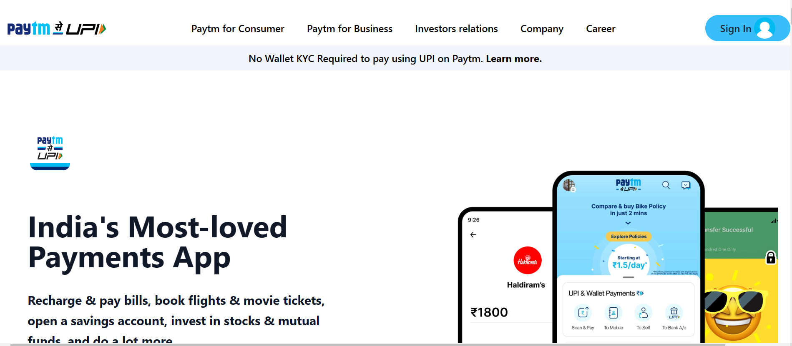
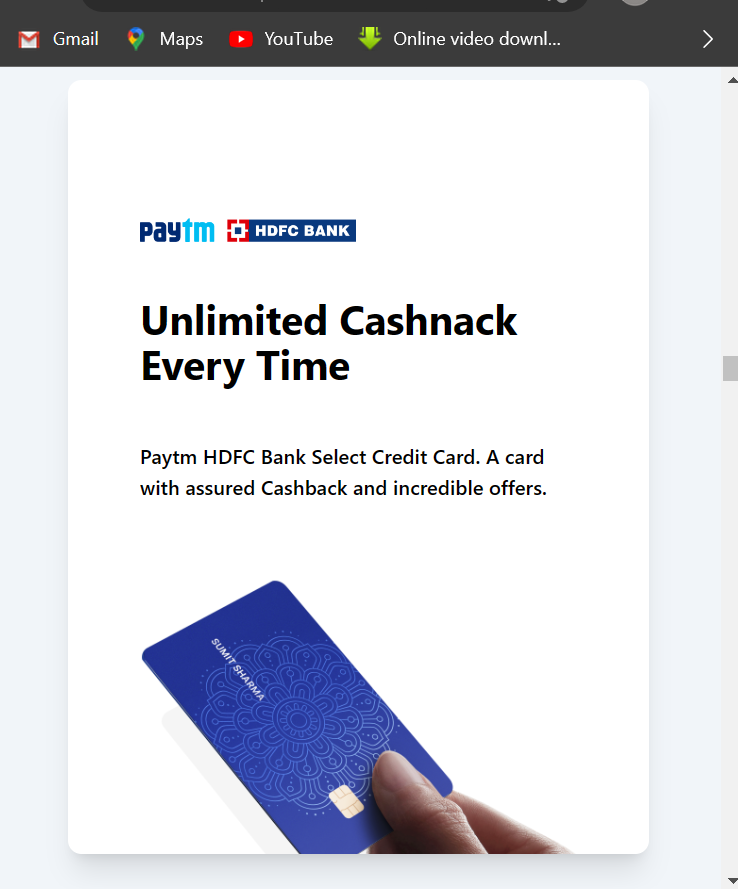

# Paytm Clone

## Made using HTML and TailWind CSS
#

#### This project is completely made by using HTML & Tailwind CSS. This Project is totally mobile resposive and try to solve the original paytm website problem which is not mobile responsive. The live link of Paytm Clone is  [here](https://www.example.com)

>Name of Assignment : **Paytm clone using HTML Tailwind CSS**

>Made By: Ram Kumar

>Time Taken: 15 hours 

